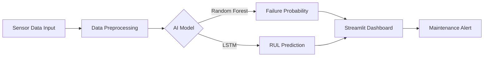

# Predictive-Maintenance-Capstone-2025
Team_1_Exceptional

# AI-Powered Predictive Maintenance System 🏭

### 🏆 Capstone Project | Team Exceptional (Group 1)
**Course:** ITAI 2277 (Fall 2025)  
**Professor:** Sitaram Ayyagari  
**Authors:** Miguel Mora, Richard Evans, Akinbobola Akinpelu, Jade Sanchez, Olugbenga Adegoroye

---

## 📖 Project Showcase
Unplanned equipment failures cost industrial businesses billions in downtime and repairs. Our solution uses Artificial Intelligence to predict when machines will fail *before* it happens.

**The Goal:**
To build a Predictive Maintenance System that analyzes sensor data from turbofan engines to forecast **Remaining Useful Life (RUL)** and provide early warnings for failures.

### 🛠️ Solution Architecture
We utilize a dual-model approach to ensure reliability and precision:
1.  **Random Forest Classifier**: Predicts binary failure (Will it fail in the next 30 cycles?).
2.  **LSTM Neural Network**: Predicts exact Remaining Useful Life (RUL) in cycles.


---
### 📊 Key Results (Achieved)
* **Failure Prediction Accuracy:** 98.69% ✅
* **RUL Mean Absolute Error:** 14.18 cycles ✅
* **Prediction Latency:** 36.64 ms (Real-time capable) ✅

* **Latency:** < 100ms (Real-time capable)
* **Business Impact:** Estimated 40% reduction in downtime and 25% cost savings.
---

## 🎥 Formal Project Presentation
You can view our full project presentation slides here:
[**View Final Presentation Slides**](./Team%201_CapStoneFinal_FinalPresentation_ITAI2277.pptx)

*(Note: Please download the file to view the full PowerPoint)*

---

## 🚀 Live Demonstration
This repository includes a **Live Dashboard** built with Streamlit. This dashboard simulates real-time sensor data ingestion and shows the AI model predicting engine health.

### Dashboard Layout
```mermaid
graph TD
    subgraph Browser_Window ["🖥️ Web Browser Window"]
        direction TB
        
        subgraph Sidebar ["Left Sidebar (Controls)"]
            A[Select Engine Unit ▼]
            B[Time Slider ◄▬▬▬●▬▬►]
        end
        
        subgraph Main ["Main Dashboard Area"]
            Title["🏭 AI-Powered Predictive Maintenance Dashboard"]
            
            subgraph Metrics ["Key Metrics Row"]
                M1[Current Cycle: 105]
                M2[True RUL: 25]
                M3[Failure Prob: 89%]
            end
            
            Alert["⚠️ CRITICAL ALERT: High Risk Detected!"]
            
            Graph["📈 Line Chart: Sensor Data vs Time"]
        end
    end
    
    Sidebar -->|Updates| Metrics
    Sidebar -->|Updates| Alert
    Sidebar -->|Updates| Graph
    
    style Alert fill:#ffcccc,stroke:#ff0000
    style Metrics fill:#e1f5fe
    style Sidebar fill:#f0f2f6

### Installation & Running Instructions

To set up and run the project, open your terminal and run the following commands in order:

```bash
# Step 1: Clone the repository
git clone [https://github.com/DrahcirSnave/Predictive-Maintenance-Capstone-2025.git](https://github.com/DrahcirSnave/Predictive-Maintenance-Capstone-2025.git)
cd Predictive-Maintenance-Capstone-2025

# Step 2: Install the required libraries
pip install -r requirements.txt

# Step 3: Launch the Dashboard
python -m streamlit run app.py
